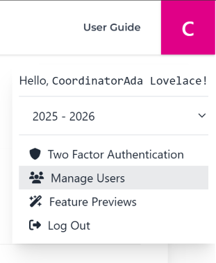
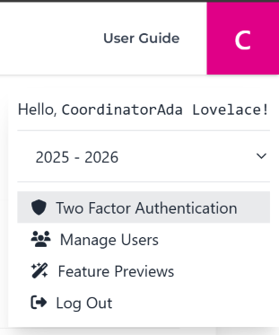
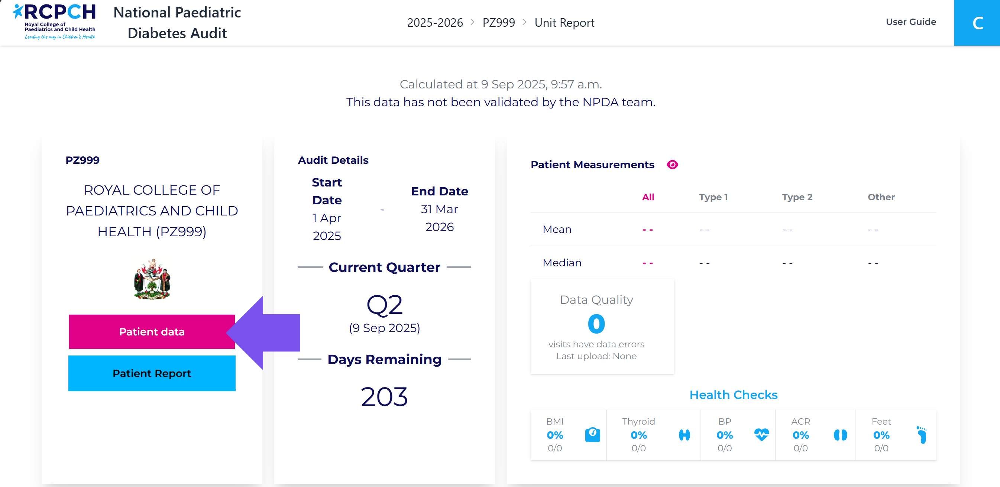
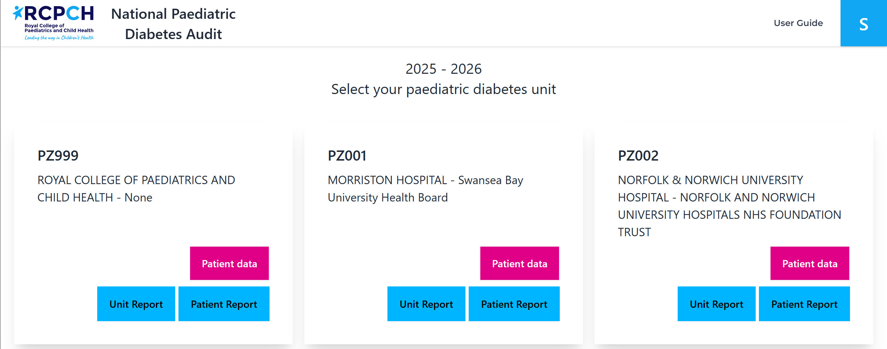
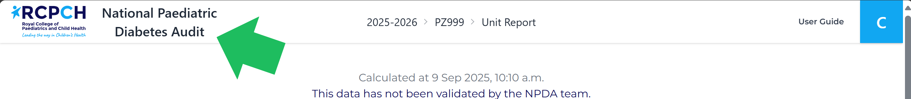
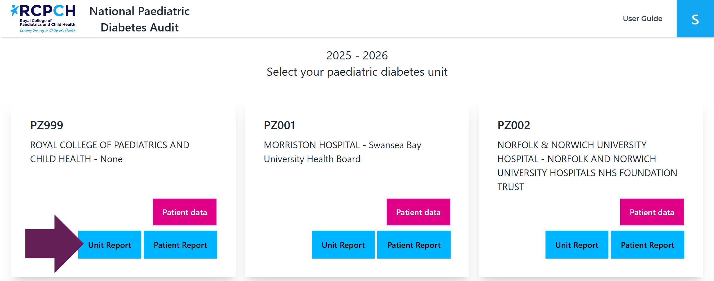
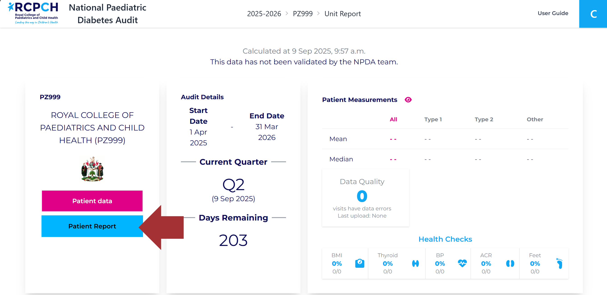

## Getting Started

### Making a new account

Lead Clinicians from NHS paediatric units must contact the NPDA team to create their own accounts. Clinicians and Administrators can request an account from their lead clinician. Alternatively, they can contact the NPDA team directly, but their account will only be created with written permission from the relevant PDU Lead Clinician.

If you are a lead clinician and already have an account on the NPDA data capture system, you can create new accounts for team members at your unit by navigating to the top right-hand corner of the window, where you will see your first initial.

Clicking on this will open a drop-down menu containing the option "Manage Users." Selecting this will display a list of all current users at your unit. Below this list, you will find the "Add NPDA User" button. Clicking on this will allow you to fill in the relevant details to register a new user on the NPDA data capture system. 

### Logging in

If you already have an account, you can log in here - https://npda.rcpch.ac.uk/account/login/ 
If you are unable to log in, please follow the ‘password reset’ guidance below.

#### Logging in for the first time

When an account has been created for you, you will receive an autogenerated email from npda@rcpch.tech. Please check your junk or spam folder in case the email has been incorrectly filtered. To set up your password for the NPDA data capture system, click on the link provided in the email. ***This link expires in 72 hours, so please ensure you create your password promptly. If the link expires, you can request a new one by following the ‘Reset Password’ guidance below.***

Your password must meet the following requirements:

- Minimum of 10 characters
- Must contain ONE capital
- Must contain ONE number
- Must contain ONE symbol from !@£$%^&*()_-+=|~
- Must NOT be exclusively numbers
- Must NOT be same as your email, name, surname

Once you have set your password, a confirmation page will appear stating that your password reset has been completed and that you can now log in to the data capture system. Click on the “Log in page” link to proceed.

#### Two Factor Authentication

When logging in for the first time with your new password, you will be required to complete a CAPTCHA verification. After this, the system will prompt you to ***enable two-factor authentication (2FA)***. Click ***“Next”*** to continue.

You will then be given two options for 2FA: ***Token Generator*** or ***Email.***

- ***Token Generator***: This option requires the ***Microsoft Authenticator*** app. If you haven't already, download the app on your mobile device. Open the app, tap the “+” button in the top right corner, select “***Work or school account***”, and then choose “***Scan QR code***”. Use your device to scan the QR code displayed on the NPDA data capture system.
- ***Email***: If you select this option, you will receive an autogenerated email containing a six-digit code. Copy and paste this code into the designated box on the data capture system.

Once you have completed the two-factor authentication setup, you will be able to access the NPDA data capture system.
If you need to change which two-factor authentication process you’d like to use, you’ll need to do this when you have logged into your account. To change it, go to the initial in the top right corner of the home page, click on the two-factor authentication option on the drop-down menu. From here you will be able to reset the process and choose with one you prefer. 

### Reset password

If you have forgotten your password, click ‘Reset Password’ or go to https://npda.rcpch.ac.uk/account/password-reset/ and a link to create a new password will be sent to your email address, and this will remain active for 72 hours.

## Submitting Data

To submit data once logged in, click on the **Patient Data** link:

If you work at more than one PDU, you can click the link for the PDU you want to submit:

If this is the first time your unit is submitting data in the audit year, you will be presented two options: ***Upload CSV file*** or ***Patient Questionnaire***.

Once you have selected a method of data entry, you will only be able to enter data via that method for the remainder of the audit year. You will not be able to enter data via both CSV and questionnaire in the same audit year. 
If you need to change your data entry method, please contact the NPDA team.

## Upload CSV File

### Preparing your CSV

In order to ensure that the data you enter provides an accurate report and to support us to clean, analyse and report the data without avoidable delay, please note the following when you are preparing your submission: 

- Ensure that every patient visit within the audit year to date is included in the file, even if you have already uploaded these visits. Each file upload will overwrite the last upload in the audit year.
- Name your csv file starting with your PZ code i.e. ‘PZ100 NPDA data 2526 Q1.csv’.
- The following are required for all rows of data include the following and these are consistent for each patient:
     - NHS number
     - Date of birth
     - Date of diagnosis
     - Visit date - This optimises our ability to organise, clean and analyse the data to provide you with an accurate report.
- All data entered are in the formats specificed in the Dataset Guide, for example:
     - ***Dates***: dd/mm/yyyy
     - ***Categorical data***: enter only the specified number of letter that corresponds to the relevant category/type
     - ***Numeric variables***: enter only the numeric value, do not include measurement type (mmol/mol or %) e.g. 12.4
     - Postcode, PZ code and GP practice code are all in correct format
     - Ensure that no unnecessary text is included, such as 'new patient', 'unknown', or patients' names.
- If unit are exporting from Twinkle/Diamond, they need to make sure that 'Exclude patients with no organisation code specified' is not ticked when they generate the report.

### Entering patient results and admission dates

- If you receive the results of a patient after their visit, please enter the 'Observation Date' of that particular result as the 'Visit Date'.
- Similarly, if a patient is admitted to your unit, enter the 'Admission Date' as the visit date.

### How should I record individuals who have either transitioned or left our service

If a patient has had a visit during the audit year and then either transitioned or left your service:
- Please record their date of transition/leaving the service with their last entry.

If a patient has not visited your clinic during the audit year and has either transitioned or left your service, but your clinic has received their results within the audit year:
- Please record their results and enter the ‘Observation Date’ of that particular result as the ‘Visit Date’.
- Please record their date of transition/leaving the service with their last entry.

If a patient has not visited your clinic during the audit year, has no results within the audit year, and has either transitioned or left your service:
- Please include still include these patients as this enables us to calculate how many patients have left your service.
- Record their date of transition/leaving the service and use this as your ‘Visit Date’.

## Submitting your CSV

Please note that the screenshots within this document include fictional patient data for illustrative purposes only.

Once you have selected your data entry method for the audit year, you will be directed to a new screen with two options. ***Option 1*** allows you to download the standardised CSV template required for uploading data to the data capture system. This template includes all the necessary columns needed for a successful data submission.

***Option 2*** allows you to select a CSV file from your device and submit data. Please ensure that your data has been thoroughly checked and finalised before submission. If the file does not match the correct format or template, it will be rejected

If the CSV file is in the correct format and successfully uploads you will be directed to a new webpage displaying all submitted patient records.

Any patient records identified issues will be highlighted with a red exclamation mark. By hovering over the exclamation mark, a pop-up box will appear, detailing the specific issue with that patient’s submission. Users should review these flagged entries and make any necessary corrections before finalising their data. It should be noted that the data has successfully submitted at this point, however, there may be issues that impact the quality of the submission. 

You can view all errors in your data file by downloading the data quality report.

### Data Quality Report

After uploading your data via CSV, you can download a ***Data Quality Report*** to validate and check your data. This can be done by selecting the Download Data Quality Report option in the top right corner of the webpage (see screenshot below).

Once downloaded, open the report in Excel. The report will have three tabs: your original submission, your submission with errors annotated, and a list of errors. 

Any cells containing errors or invalid data will be highlighted with a small comment explaining the issue (e.g., ***invalid date format***). To correct these errors, you must update your original CSV file and re-upload the corrected version to the data capture system.

## Upload data via Patient Questionnaire

### Add a New Patient

Navigate to the ***Patient Data*** view and select ***Add Patient***.

This form will ask you to complete all the necessary information to add a new patient to your NPDA submission.

After successfully entering a patient onto the NPDA data capture system, you will be directed to a new screen displaying a list of all patients you have entered.

### Edit Patient Details

To edit patient details in the future, click on their NHS number in the Patient list. You can also record whether they have left the service in this form.

### Create Visits

From this list, you can add visits for each patient. On the right-hand side of each patient entry, there is a clickable link labelled "***Visits***". Clicking this will take you to a new screen where you will see the option "***Create New Visit***". Selecting this option will open a new web form for you to complete. 

After you’ve clicked on the Create New Visit button, you will be then greeted with the New Visit webform.

From here you will see the Visit/Appointment date at the top of the page. A valid date will need to be entered to create a fully visit. After this you can see 3 tabs below the visit date, these are: Routine Measurements, Annual Review and Inpatient Entry. 

The Routine Measurements tab is broken down by the following sections:
- Measurements
- HbA1c
- Treatment
- CGM
- Blood Pressure (BP)

The next tab, Annual Review, contains the following metrics:
- Foot Care
- DECS (Retinal Screening)
- ACR (Urinary Albumin)
- Cholesterol
- Thyroid
- Coeliac
- Psychology
- Smoking
- Dietician
- Sick Day Rules
- Immunisation (flu)

The final tab, Inpatient Entry, contains the following metric
- Hospital Admission

After you have entered all the relevant information click the ‘Save’ button at the bottom of the page.

## Page 7 - Unit Report/Patient Report

You can access the unit report by clicking the NPDA logo at the top of each page:

Users in multiple PDUs can click the "Unit Report" link for the PDU they want to access:

### Unit Report

The Unit Report tab provides an overview of the patient data you have entered, including:
- Quarterly submission deadlines,
- The number of Trusts within your unit's network,
- Total number of eligible patients,
- Patient characteristics,
- Treatment regimen,
- HbA1c,
- Glucose monitoring,
- and other key metrics relevant to your unit. 

Please note that the graphs within this tab display unvalidated and uncleaned data, meaning figures may differ from those published in the Quarterly Reporting Dashboard and the NPDA annual reporting.
The unit report is intended to give you a quick view of your unit’s data

## Unit Report - Interactive Charts and Tooltips

The Unit Report tab contains various interactive charts that provide detailed insights into your unit's data. To access additional information within the charts, hover your cursor over specific elements:

- ***Box and Whisker Plots*** – Hovering over black dots in these plots will reveal a scatter plot of individual patients, identifiable by NHS number. This allows you to see where each patient sits within the overall cohort distribution.

- ***Statistical Values*** – Key statistics such as interquartile range (IQR), medians, and means are displayed when hovering over different parts of the chart.

- ***New Diagnoses Plots*** – Tooltips are included to explain the difference between cumulative and quarterly values, providing clarity on how the data is presented.

### Patient Report

Clicking on the Patient Report tab will display a list of patients identified by their NHS number, along with five separate tabs at the top of the report: 
- Health Checks,
- Additional Care Processes,
- Care at Diagnosis,
- Outcomes,
- and Treatment. 

Each tab presents key data related to patient care and monitoring. The report is structured to visually indicate whether a required check has been completed. If a patient has undergone a check, a green tick will appear in the corresponding column. If a check is incomplete, a yellow exclamation mark will be displayed, highlighting that the required data is missing. 

This layout provides a clear and efficient way to track patient care processes and identify areas requiring further attention.

